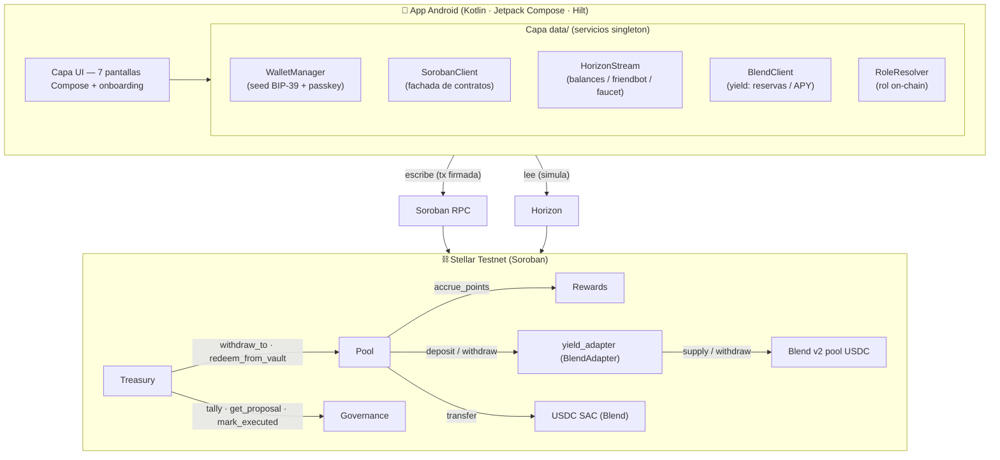

# 🌱 RAÍZ
> **Tu paga, el barrio crece.**

🌐 [raizapp.xyz](https://raizapp.xyz) · 🎤 [Entrevistas a comercios y residentes (Drive)](https://drive.google.com/drive/folders/1vd_3RpL_2eZphFwEavG5rx7ZF3PYScdp?usp=sharing) · 📽️ [Video demo](https://www.youtube.com/watch?v=y-9pglgVnnA)

**RAÍZ** es una red de pagos turísticos sobre **Stellar** que redirige un **"Tip Barrio"** (2% por defecto) de cada pago a un **fondo comunitario gobernado por los residentes del barrio** mediante tokens *soulbound* (no transferibles). El turista paga al comercio en USDC, un porcentaje se desvía automáticamente al pool del barrio, y los residentes votan en qué se reinvierte — todo **on-chain**, sin backend propio y sin que nadie tenga la llave del fondo.

App Android nativa + 5 contratos Soroban (Rust) desplegados y poblados en **Stellar Testnet**.

---

## 1. El problema y la solución 🧭

### El problema: turismo extractivo

El turismo **extrae** valor de los barrios con encanto. Las plataformas, las cadenas y la plusvalía se llevan el margen; quien **crea** el atractivo —los residentes, los artesanos, el comercio de esquina— captura una fracción mínima y **no decide nada** sobre cómo se reinvierte. El resultado: gentrificación, barrios vaciados de su gente y cero transparencia sobre a dónde fue el dinero.

### La solución: RAÍZ

Tres ideas, una sola app:

| Pilar | Qué hace | Por qué importa |
|---|---|---|
| **Tip Barrio automático** | El 2% (configurable) de cada pago va al pool del barrio, vía contrato. | Valor que se queda donde se genera, sin intermediarios ni confianza ciega. |
| **Gobernanza de residentes (soulbound)** | 1 residente = 1 voto intransferible. Proponen y votan en qué se invierte el fondo. | El voto **no se puede comprar** ni ceder. Democracia de barrio verificable. |
| **Ejecución trustless + transparencia** | Si una propuesta pasa quórum y mayoría, el Treasury la ejecuta **sin que nadie tenga la llave**. Todo se ve en un dashboard público. | Cada pago, voto y ejecución es auditable en la cadena. |

El turista gana **puntos canjeables** por artesanías locales; el comercio cobra al instante en dólar digital; el barrio acumula, **rinde** (yield en Blend v2) y decide.

---

## 2. Arquitectura 🏗️

RAÍZ no tiene servidor propio: **todo el estado vive on-chain** en 5 contratos Soroban; el yield del fondo va directo al pool USDC de **Blend v2** a través del contrato propio `yield_adapter`. La app Android es un cliente delgado que **lee por simulación** (Soroban RPC, sin firmar) y **escribe** enviando transacciones firmadas con la clave del usuario.



### Los 5 contratos

| Contrato | Crate | Rol en una línea |
|---|---|---|
| **Pool** | `contracts/pool` | El corazón. Recibe el pago, separa el monto del comercio, el Tip Barrio (al pool) y el fee (al admin); custodia el fondo; gestiona el índice de comercios para el mapa y deposita/rescata el fondo ocioso en Blend v2 vía el YieldAdapter (con colchón líquido del 20%). |
| **Governance** | `contracts/governance` | Democracia del barrio. Mintea tokens de residencia *soulbound*, gestiona propuestas, votación, quórum (30%) y *tally* idempotente. **Nunca implementa `transfer()`.** |
| **Treasury** | `contracts/treasury` | Ejecución trustless. Cualquiera puede llamar `execute_proposal`: el contrato verifica en Governance que la propuesta pasó, rescata el yield de Blend y ordena al Pool transferir al beneficiario. No custodia fondos: orquesta. |
| **Rewards** | `contracts/rewards` | Puntos no transferibles + catálogo de premios (artesanías). Solo el Pool puede acumular puntos; el turista canjea (`redeem`) y el artesano confirma la entrega (`claim`). |
| **YieldAdapter** | `contracts/yield_adapter` | BlendAdapter: puente contable por barrio hacia el pool USDC de Blend v2 (`deposit / withdraw / shares_of / total_shares / value_of / apy_hint / claim_blnd`; shares = bTokens). Hace **intercambiable** la fuente de yield. |

### Relaciones cross-contract

- `Pool → Rewards.accrue_points` — cliente declarado a mano con `#[contractclient]` (Rewards valida `caller == pool` para que nadie infle puntos).
- `Pool → YieldAdapter` (`deposit` / `withdraw`) — cliente `#[contractclient]`; el depósito usa `authorize_as_current_contract` para la sub-transferencia hacia Blend. El Pool **nunca** habla con Blend directamente.
- `Treasury → Governance` (`tally`, `get_proposal`, `mark_executed`) y `Treasury → Pool` (`withdraw_to`, `get_vault_shares`, `redeem_from_vault`) — clientes `#[contractclient]` mantenidos en sync con las firmas reales.

### Capa Android (`data/`)

| Servicio | Responsabilidad |
|---|---|
| `WalletManager` | Custodia de claves. Prioridad: wallet guardada > demo (`BuildConfig`) > placeholder. Deriva BIP-39 / SEP-05. |
| `PasskeyWalletManager` | Smart accounts secp256r1 (WebAuthn) vía `OZSmartAccountKit` de Soneso. |
| `SorobanClient` | Fachada de los contratos RAÍZ. Lecturas con `signer=null` (simulación), escrituras firmadas. Cachea un `ContractClient` por contrato. |
| `HorizonStream` | Balances USDC/XLM (polling + `distinctUntilChanged`), trustlines, friendbot, faucet de USDC. |
| `BlendClient` | Lecturas puras del yield: `get_reserve` del pool de Blend + `apy_hint` del adapter. Alimenta la pantalla Yield ("Pool Blend v2 · USDC", APY estimado · variable), sin API key. |
| `RoleResolver` | Deriva el rol on-chain (residente → comerciante → turista). |
| `SecureWalletStore` · `ScvalParse` · `DeploymentsLoader` | Persistencia cifrada de la seed · parseo SCVal→Kotlin · carga de `deployments.json`. |

---

## 3. Flujos principales 🔄

### (a) Pago con Tip Barrio — el flujo central

`PayScreen` → `SorobanClient.payMerchant(...)` → `Pool.pay_merchant`:

```
tourist.require_auth()
validar amount > 0  y  tip_bps ≤ 10_000
cargar comercio (debe existir y estar verified)  → cargar su barrio

  tip      = amount * tip_bps / 10_000        (200 bps = 2%)
  fee      = amount * fee_bps  / 10_000        (50 bps  = 0.5%)
  to_merch = amount - fee

  USDC.transfer(turista → comercio, to_merch)     # 1
  USDC.transfer(turista → pool,     tip)          # 2  (si tip > 0)
  USDC.transfer(turista → admin,    fee)          # 3  (si fee > 0)

  barrio.pool_balance += tip ; total_collected += tip ; tx_count++
  si turista nuevo en el barrio → unique_tourists++

  Rewards.accrue_points(pool_self, turista, tip)  # cross-contract: +puntos
  emitir evento  payment(tourist, merchant, amount, tip)
```

> El comercio recibe `amount − fee`; el tip es **adicional** (sale aparte del turista hacia el pool). 1 punto = 0,01 USDC de tip.

### (b) Gobernanza → ejecución trustless

```
(admin barrio) mint_resident ──────────▶ residentes con token soulbound (1 = 1 voto)
       │
(residente) create_proposal(amount, recipient, 3–14 días) ──▶ Proposal Active
       │
(residentes) vote(support) ─────────────▶ votes_for / votes_against   (sin doble voto)
       │   ... pasa closes_at ...
(cualquiera) tally ──▶ quórum (for+against)·100 ≥ 30·residentes  +  mayoría for>against
       │                                                   └─▶ Passed | Rejected
(cualquiera) Treasury.execute_proposal ──▶ ¿tally == Passed?
       │            ├─ rescata yield de Blend (si hay shares)
       │            ├─ Pool.withdraw_to(recipient, amount)
       │            ├─ registra Execution (auditable)
       │            └─ Governance.mark_executed
       ▼
   evento execution ──▶ Dashboard de transparencia
```

### (c) Yield: Blend directo tras el YieldAdapter

El fondo ocioso del barrio **rinde** depositándose en el pool USDC de **Blend v2**, siempre a través del contrato propio `yield_adapter` (**BlendAdapter**) — el Pool nunca habla con Blend directamente. Un solo camino, on-chain de punta a punta:

- `Pool.deposit_idle_to_vault(caller, barrio, amount)` → mueve USDC del fondo a Blend vía el adapter y registra las *shares* (bTokens) del barrio. Respeta un **colchón líquido** (`CushionBps`, 20% por defecto, ajustable por el admin con `set_cushion_bps`): si el depósito lo violara, falla con `InsufficientLiquidity`.
- `Treasury.execute_proposal` → llama `Pool.redeem_from_vault` para realizar el yield **antes** de pagar al beneficiario.
- En la app, la pantalla **Yield** (`BlendClient`) muestra "Pool Blend v2 · USDC" con APY **estimado · variable**, todo con lecturas puras (`get_reserve` del pool de Blend + `apy_hint` del adapter), sin API key.

```
Pool (fondo ocioso) ──deposit_idle_to_vault──▶ yield_adapter (BlendAdapter) ──supply──▶ Blend v2 pool USDC
       ▲                                                                                      │ (yield)
       └────────── redeem_from_vault ◀────────── withdraw ◀───────────────────────────────────┘
```

> La interfaz `YieldAdapter` (`deposit / withdraw / shares_of / total_shares / value_of / apy_hint / claim_blnd`) desacopla al protocolo de su fuente de yield: cambiar Blend por otra fuente es desplegar otro adapter y aprobarlo por gobernanza. Esa intercambiabilidad **es la tesis del protocolo**: el barrio decide dónde rinde su fondo.

### (d) Onboarding de wallet nueva

Dos formas de crear cuenta, más selección de rol:

```
┌─ Passkey (WebAuthn) ──▶ smart account secp256r1 (C...) vía OZSmartAccountKit (Soneso)
│                          relayer público patrocina el deploy en testnet · Android 9+
└─ Frase semilla ──────▶ KeyPair BIP-39 / SEP-05 (G...) · seed cifrada en el dispositivo

luego: elegir rol → 🧳 Turista · 🏪 Comerciante · 🏡 Residente
```

Para wallets nuevas, un banner guía el alta on-chain en 3 pasos (re-chequea tras 1,5 s):

```
¿cuenta existe?      ── no ─▶ FUND_XLM        → friendbot fondea XLM (testnet)
¿tiene trustline USDC? ─ no ─▶ ACTIVATE_TRUST  → ChangeTrust firmado por el usuario
¿balance USDC == 0?  ── sí ─▶ REQUEST_USDC    → faucet envía USDC (simula on-ramp SEP-24)
   └─ todo ok ─▶ DONE (banner oculto)
```

### (e) RBAC dinámico — `RoleResolver`

El rol no se hardcodea: se detecta on-chain consultando los contratos.

```
resolve(address):
   1. getResident(address)           → ¿ResidentToken? → RESIDENT  (prioritario)
   2. listBarrios() → por cada barrio: listMerchants() → ¿está? → MERCHANT
   3. si nada → TOURIST
   (cachea por address; fallback a los barrios del seed si list_barrios viene vacío)
```

---

## 4. Stack tecnológico 🧰

| Capa | Tecnología | Notas |
|---|---|---|
| Contratos | **Rust + `soroban-sdk` 26.1.1** | `#![no_std]`, workspace Cargo con 5 crates · Rust 1.97.1 pineado · CI en GitHub Actions |
| Red | **Stellar Testnet** + Soroban RPC | Horizon (lecturas/balances) + Soroban RPC (contratos) |
| Token | **USDC** vía Stellar Asset Contract (SAC) | USDC de Blend (el que acepta su pool de préstamos) |
| App | **Kotlin + Jetpack Compose + Material 3** | `minSdk 26`, `targetSdk 35`, JDK 17 |
| DI | **Hilt (Dagger) + KSP** | módulo `DataModule` |
| SDK Stellar | **kmp-stellar-sdk 1.6.0 (Soneso)** | Horizon, Soroban RPC, `ContractClient`, SEP-05, smart accounts |
| Mapas | **Mapbox Maps SDK 11.x** + maps-compose | comercios geolocalizados (`lat/lng × 1e6`) |
| Wallet | **Passkey (WebAuthn secp256r1)** + fallback **seed BIP-39** | smart account OZ (Soneso) o KeyPair clásico |
| Yield | **Blend v2 directo** (`yield_adapter` propio) | prestamista puro, sin intermediarios ni API keys; colchón líquido 20% |
| Concurrencia | Coroutines + StateFlow | MVVM por pantalla |
| QR | ZXing (core + embedded) | generar/escanear códigos de pago |
| TLS | **Conscrypt** | provider de Google instalado en `RaizApplication` para testnet |
| Seguridad | **EncryptedSharedPreferences + Android Keystore + BiometricPrompt** | seed cifrada, bloqueo biométrico/PIN |

### Convenciones críticas

- **Montos USDC:** siempre `i128` (Rust) / `Long` (Kotlin) en **stroops**. `1 USDC = 10_000_000 stroops` (7 decimales). Nunca floats.
- **Basis points:** `tip_bps = 200` (2%), `protocol_fee_bps = 50` (0,5%). Cálculo en orden `amount * bps / 10_000`.
- **`barrio_id`:** `BytesN<32>` (Rust) ↔ hex de 64 chars (Kotlin). Direcciones: `G…` cuentas, `C…` contratos.
- **Quórum 30%** de residentes + **mayoría simple**. Duración de propuesta: 3–14 días.
- **Puntos:** `u64`, no transferibles, `1 punto = 0,01 USDC de tip = 100_000 stroops`.

---

## 5. Integraciones 🔌

| Integración | Estado | Detalle |
|---|---|---|
| **Stellar / Soroban** | ✅ En testnet | Horizon (balances, friendbot, trustlines) + Soroban RPC (5 contratos: read por simulación, write firmado). |
| **Blend v2** | ✅ Directo vía `YieldAdapter` | El fondo rinde como prestamista puro en el pool USDC de Blend v2 (TestnetV2), sin vault intermediario ni API key. Cuentas fondeadas con el faucet de Blend. (Pre-F1 se usaba el vault DeFindex — eliminado el 2026-07-31.) |
| **Mapbox** | ✅ | Mapa de comercios del barrio sobre Maps SDK 11.x + maps-compose. |
| **Passkey / WebAuthn (smart accounts)** | ✅ Implementado y demostrado | `OZSmartAccountKit` de Soneso (contrato OpenZeppelin). Infra pública testnet: **relayer** (patrocina fees de deploy), **indexer** y **verifier** WebAuthn. Requiere Android 9 (API 28). |
| **Anchors SEP (on/off ramp)** | 🟡 **Planeado** | SEP-10 (auth), SEP-24 (deposit/withdraw fiat↔USDC interactivo), SEP-38 (quotes RFQ). En el roadmap: anchors como **MoneyGram Access** (efectivo) o **Vibrant/Anclap** (LatAm). **Hoy** el on-ramp se simula con el faucet de Blend en testnet. |

---

## 6. Seguridad 🔐

- **Bloqueo de la app** con `BiometricPrompt` (huella/rostro **o** PIN/patrón del dispositivo, vía `BIOMETRIC_STRONG or DEVICE_CREDENTIAL`). Se re-bloquea al volver de background. Opt-in desde Perfil.
- **Biometría al confirmar pago** — la autorización del usuario se exige antes de firmar.
- **Soulbound NO transferible** — Governance jamás implementa `transfer()`; el voto no se puede comprar ni ceder (es la tesis del proyecto).
- **Montos siempre en stroops** (`i128`/`Long`) — sin floats, sin pérdida de precisión.
- **Secrets fuera del repo** — claves demo, token de Mapbox y config de passkey viven en `local.properties` (no versionado), inyectados como `BuildConfig`.
- **Seed cifrada** en el dispositivo con `EncryptedSharedPreferences` + clave del Android Keystore.
- **Validación de inputs** en cada escritura on-chain (`require_auth`, montos > 0, `tip_bps ≤ 10_000`, comercio `verified`, residencia del barrio correcto, sin doble voto, stock/puntos suficientes).

### ⚠️ Limitación conocida (bloqueante de mainnet)

La **clave del admin demo va embebida en el APK** (`BuildConfig.DEMO_ADMIN_SECRET`) para poder demostrar el alta de comercios y el mint de residentes sin coordinación offline. **No publicar como release.** El fix post-hackathon es mover esa autoridad a un **backend/relayer** que firme las operaciones de admin (registro de comercios, mint de residencia, faucet), de modo que la app del usuario nunca tenga la clave del admin.

---

## 7. Contratos desplegados (Stellar Testnet) 📜

| Contrato | Dirección | Explorer |
|---|---|---|
| **Pool** | `CD775D33SPEO3BTAZIEQTQGN6HERTR5YNEQOZWWKXLDKLJ2B34LCKBE2` | [↗ ver](https://stellar.expert/explorer/testnet/contract/CD775D33SPEO3BTAZIEQTQGN6HERTR5YNEQOZWWKXLDKLJ2B34LCKBE2) |
| **Governance** | `CBBYI45J3VWQ53QATRWTARCFWNIG7EEZTFCS5OXJWS7KRCPOHQXHAL32` | [↗ ver](https://stellar.expert/explorer/testnet/contract/CBBYI45J3VWQ53QATRWTARCFWNIG7EEZTFCS5OXJWS7KRCPOHQXHAL32) |
| **Treasury** | `CACZWU3BXMCHI23CFN2GTPWCGSQKABMYF7EOMA2J63RMGAEZVXDFPATB` | [↗ ver](https://stellar.expert/explorer/testnet/contract/CACZWU3BXMCHI23CFN2GTPWCGSQKABMYF7EOMA2J63RMGAEZVXDFPATB) |
| **Rewards** | `CDTTEZX2QO3L2A4EC34VGVAWYAI4CQD42SGYMFQNNTEQWYU5SHFU5DZJ` | [↗ ver](https://stellar.expert/explorer/testnet/contract/CDTTEZX2QO3L2A4EC34VGVAWYAI4CQD42SGYMFQNNTEQWYU5SHFU5DZJ) |
| **YieldAdapter** | `CA5J6YVHZQQKB64ODHCUI65AIK24BQGLL42UZTBV7NPT5GI4ASBJPJUC` | [↗ ver](https://stellar.expert/explorer/testnet/contract/CA5J6YVHZQQKB64ODHCUI65AIK24BQGLL42UZTBV7NPT5GI4ASBJPJUC) |
| USDC SAC (Blend) | `CAQCFVLOBK5GIULPNZRGATJJMIZL5BSP7X5YJVMGCPTUEPFM4AVSRCJU` | [↗ ver](https://stellar.expert/explorer/testnet/contract/CAQCFVLOBK5GIULPNZRGATJJMIZL5BSP7X5YJVMGCPTUEPFM4AVSRCJU) |
| Blend v2 pool USDC | `CCEBVDYM32YNYCVNRXQKDFFPISJJCV557CDZEIRBEE4NCV4KHPQ44HGF` | [↗ ver](https://stellar.expert/explorer/testnet/contract/CCEBVDYM32YNYCVNRXQKDFFPISJJCV557CDZEIRBEE4NCV4KHPQ44HGF) |

> Red: **testnet** · `protocol_fee_bps = 50` (0,5%) · desplegados el **2026-07-31** con la identidad `raiz-admin` (`GBLS7PL5Y65DHQIPMJO6HVQLX4FXEEHQDWHGSBUTGT4V6ZV2IOACYC2P`). El Pool expone **`list_barrios`** (RBAC dinámico). USDC = el de **Blend** (el que acepta su pool v2), no un USDC propio. La fuente canónica de IDs es **`deployments.json`** — cambian con cada re-deploy.

### Eventos on-chain (alimentan el dashboard de transparencia)

| Contrato | Evento | Topics → Data |
|---|---|---|
| Pool | `payment` | `(symbol_short!("payment"), barrio_id)` → `(tourist, merchant, amount, tip)` |
| Pool | `vault_dep` / `vault_red` | `(…, barrio_id)` → `(amount, shares)` / `(shares, got)` |
| Governance | `resident` · `proposal` · `vote` · `tally` | altas de residencia, propuestas, votos y resultados |
| Treasury | `execution` | `(symbol_short!("execution"), barrio_id)` → `(proposal_id, amount, recipient)` |
| Rewards | `redeem` · `claim` | canjes y entregas de premios |

---

## 8. Pipeline / Cómo correr 🚀

### Requisitos

- Rust toolchain con target `wasm32-unknown-unknown` + **Stellar CLI 23.x**.
- Android Studio (JDK **17/21** — no 25; usa el JBR de Android Studio).
- Node (para parsear `deployments.json` en los scripts de seed).

### 1) Contratos — build y test

```bash
cd contracts

# Build a wasm. IMPORTANTE: usar `stellar contract build` (target wasm32v1-none).
# `cargo build --target wasm32-unknown-unknown` NO sirve para deploy: emite
# instrucciones reference-types que el host de Soroban rechaza.
# (rewards se compila también a wasm32-unknown-unknown para el contractimport! del Pool)
cargo build --release --target wasm32-unknown-unknown -p rewards
stellar contract build

# Tests del workspace (55/55 pasando)
cargo test
```

> Slash commands equivalentes: `/build-contracts`, `/test-contracts`.

### 2) Deploy + seed a testnet

```bash
# Asegura la identidad raiz-admin, compila y despliega los 5 contratos
# (incluido yield_adapter, apuntando al pool USDC de Blend v2), inicializa en
# orden, escribe deployments.json Y lo copia a los assets de la app Android.
scripts/deploy_testnet.sh

# Pobla: 3 barrios, 9 comercios (lat/lng reales), 9 residentes soulbound,
# 6 pagos con tip, depósito de prueba en Blend vía yield_adapter, 3 propuestas
# con votos y 6 rewards. Fondea cuentas con el faucet de USDC de Blend.
scripts/seed_testnet.sh
```

> Slash commands: `/deploy-testnet`, `/seed-testnet`. Los deploys a testnet son *flaky* en ráfaga (propagación RPC + rate-limit): ambos scripts **reintentan** cada operación.

### 3) App Android

```bash
cd android
./gradlew :app:assembleDebug
```

Crea `android/local.properties` con tus claves (no se versiona). Solo **nombres**, sin valores:

```properties
# Claves demo (secrets S...) para demostrar los 3 roles sin coordinar offline
raiz.tourist.secret=
raiz.resident.secret=
raiz.admin.secret=

# Mapbox public token (pk.*) para descargar tiles del mapa
mapbox.access.token=

# Passkey / smart account (WebAuthn). rpId debe coincidir con el dominio de
# assetlinks.json en producción. Vacío → el botón de passkey se oculta.
passkey.rp.id=
passkey.rp.name=RAIZ
```

---

## 9. Estado actual y roadmap 📍

### ✅ Hecho (código corriendo, no promesas)

- **5 contratos** desplegados en testnet + **85 tests** pasando (CI en GitHub Actions).
- **App Android** con **7 pantallas**: Wallet (+ RAÍZ Passport), Pagar, Premios, Mapa (Mapbox), Dashboard de transparencia, Tesorería/Yield y Perfil — más onboarding (Welcome / crear / importar / passkey / elegir rol) y alta de comercio.
- **Flujos verificados end-to-end on-chain:** pago con Tip Barrio + puntos, votación, ejecución trustless de propuesta, alta de comercio, onboarding de wallet nueva con rampa de USDC.
- **F1 — Independencia de DeFindex (2026-07-31):** el fondo rinde **directo en Blend v2** vía el contrato propio `yield_adapter` (verificado on-chain: 0.2 USDC del Centro Histórico en bTokens, APY calculado on-chain, colchón líquido 20%). La fuente de yield es intercambiable — primer paso del roadmap **F1–F6** hacia el protocolo de ahorro comunitario (`docs/NuevaPropuesta/` + `docs/ESTADO_PROYECTO_2026-07-31.md`).
- **RBAC dinámico** (`RoleResolver` on-chain) + **seguridad fase 1** (bloqueo biométrico/PIN, seed cifrada).
- **Passkey smart-wallet** (`OZSmartAccountKit` de Soneso) **implementado y demostrado**.

### 🛣️ Roadmap

El roadmap canónico es **F1–F6** de la propuesta de protocolo de ahorro (`docs/NuevaPropuesta/propuesta_raiz_ahorro_enjambre.md` §8 + `plan_trabajo_raiz.md`): **F1** Blend directo ✅ → **F2** Cadena de Barrio (`savings_circle`, ROSCA soulbound) → **F3** custodia de enjambre + atestación vecinal → **F4** metas/retos/sorteo → **F5** enjambre frontera (mesh, light-verify, DePIN) → **F6** voto secreto ZK.

Pendientes de mainnet (subordinados al roadmap F1–F6; F3 elimina los dos primeros):

- **Admin → custodia sin clave única** (multisig 2-de-3 ya preparado en `scripts/setup_admin_multisig.sh`; smart account comunal en F3) — requisito de **mainnet**.
- **Anchors SEP** reales: SEP-10/24/38 para on/off ramp fiat↔USDC (MoneyGram, Vibrant/Anclap).
- **Passkey con dominio propio** — hoy `github.io` choca con la Public Suffix List para el `rpId`; se resuelve con dominio propio + `assetlinks.json`.
- **KYC de residencia (SEP-12)** en vez del mint manual del admin.
- **IPFS** para las imágenes de premios (hoy URLs).
- **`tx_hash` real** de Stellar en las `Execution` (hoy es un sha256 determinístico) y **mainnet**.

---

## 10. Estructura del repositorio 🗂️

```
Protocolo_Raiz/
├── contracts/                       # Workspace Cargo (Rust + soroban-sdk)
│   ├── pool/        src/lib.rs       # pagos, tip split, pool, comercios, yield vía adapter
│   ├── governance/  src/lib.rs       # soulbound, propuestas, voto, tally, quórum
│   ├── treasury/    src/lib.rs       # execute_proposal trustless, log de ejecuciones
│   ├── rewards/     src/lib.rs       # puntos, premios, redeem, claim
│   └── yield_adapter/ src/lib.rs     # BlendAdapter: el fondo rinde en Blend v2 (F1)
├── android/                          # App Kotlin (Jetpack Compose + Hilt)
│   └── app/src/main/java/com/raiz/app/
│       ├── data/
│       │   ├── stellar/              # WalletManager, PasskeyWalletManager,
│       │   │                         #   SorobanClient, HorizonStream,
│       │   │                         #   BlendClient, RoleResolver, ScvalParse…
│       │   ├── security/             # AppLock (biométrico/PIN)
│       │   └── model/                # data classes espejo de los structs Rust
│       └── ui/                       # wallet, pay, rewards, map, dashboard,
│                                     #   treasury(yield), profile, welcome,
│                                     #   become_merchant, security
├── scripts/
│   ├── deploy_testnet.sh             # despliegue de los 5 contratos + sync assets
│   └── seed_testnet.sh               # datos demo (barrios, comercios, residentes…)
├── docs/                             # spec, arquitectura técnica, pitch, guías
│   ├── raiz_v2_spec_contratos.md     # spec canónica de los 5 contratos
│   ├── ARQUITECTURA_TECNICA.md       # estado real implementado, verificado vs código
│   ├── RaizModels.kt                 # modelos Kotlin espejo de los structs Rust
│   └── presentacion/pitch.md         # guion del pitch (7–10 min)
├── deployments.json                  # IDs de contratos en testnet (versionado)
├── CLAUDE.md                         # convenciones, comandos y subagentes del proyecto
└── README.md
```

---

## Licencia

MIT.

---

> **"2% de cada pago, gobernado por el barrio, verificable en la cadena."**
> RAÍZ pone la decisión on-chain, en manos de quien vive ahí — pago, gobernanza y transparencia, en una sola app, sobre Stellar. 🌱
