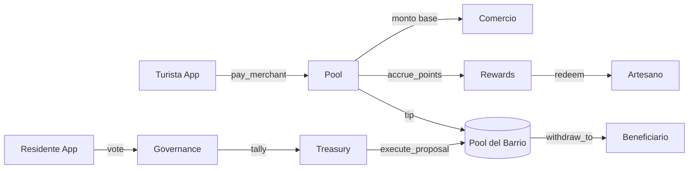

# RAÍZ

> Red de pagos turísticos sobre Stellar que redirige un porcentaje de cada pago a un fondo
> comunitario gobernado por los residentes del barrio. MVP para hackathon, todo on-chain.

## Estado

🚧 En desarrollo activo. MVP en construcción para hackathon.

## Stack

- **Contratos**: Rust + `soroban-sdk` 22.x (4 contratos en `contracts/`)
- **App**: Android nativo, Kotlin + Jetpack Compose, Material 3
- **Stellar SDK**: `kmp-stellar-sdk` de Soneso
- **Mapas**: Mapbox Maps SDK 11.x
- **Wallet**: passkey (WebAuthn) + fallback frase semilla BIP-39

## Arquitectura



Los 4 contratos:

| Contrato | Función |
|---|---|
| `pool` | Pagos turista→comercio + custodia del Tip Barrio |
| `governance` | Soulbound tokens de residencia + votación de propuestas |
| `treasury` | Ejecución trustless de propuestas aprobadas |
| `rewards` | Puntos no transferibles + catálogo de premios |

## Setup

### Requisitos

- **Rust** 1.80+ con target `wasm32-unknown-unknown`
  ```bash
  rustup target add wasm32-unknown-unknown
  ```
- **Stellar CLI** 23.x — https://developers.stellar.org/docs/tools/stellar-cli
- **JDK 17 o 21** (no 25, el Android Gradle Plugin aún no lo soporta bien)
- **Android Studio** + Android SDK
- **Node 20+** (para el script de seed en TypeScript)

### Compilar los contratos

```bash
cd contracts
cargo build --release --target wasm32-unknown-unknown
```

> El primer build puede fallar porque el contrato `pool` importa el wasm de `rewards`
> vía `contractimport!`. Compila `rewards` primero:
>
> ```bash
> cargo build --release --target wasm32-unknown-unknown -p rewards
> cargo build --release --target wasm32-unknown-unknown -p pool
> ```

### Correr los tests

```bash
cd contracts && cargo test --workspace
```

### Desplegar a Testnet

```bash
# 1. Configura una identidad si no la tienes
stellar keys generate --global raiz-admin --network testnet --fund

# 2. Despliega
./scripts/deploy_testnet.sh

# 3. Pobla con datos demo
cd scripts && npx tsx seed.ts
```

Los IDs de contratos quedan en `deployments.json` (versionado).

### App Android

```bash
cd android
./gradlew :app:assembleDebug
./gradlew :app:installDebug
```

Antes de la primera build, configura tokens de Mapbox (ver `docs/raiz_mapbox_setup.md`).

## Documentación

- `docs/raiz_v2_spec_contratos.md` — spec canónica de los 4 contratos
- `docs/RaizModels.kt` — modelos Kotlin espejo de los structs Rust
- `docs/raiz_mapbox_setup.md` — setup de Mapbox paso a paso
- `docs/raiz_prompt_claude_code.md` — prompt maestro original
- `CLAUDE.md` — guía para Claude Code (convenciones, comandos, subagentes)

## Demo

Ver `DEMO.md` para el guion de 90 segundos.

## Licencia

MIT.
