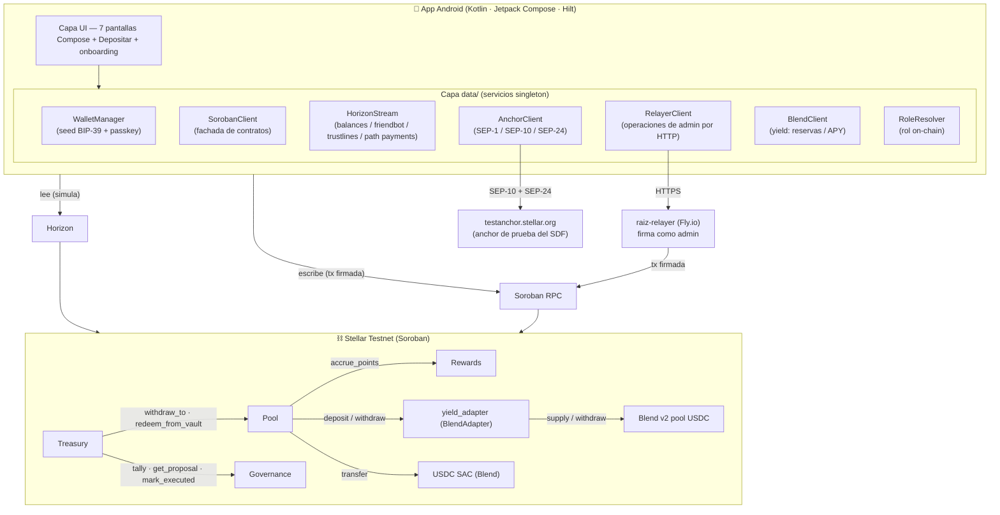

# 🌱 RAÍZ
> **Tu paga, el barrio crece.**

🌐 [raizapp.xyz](https://raizapp.xyz) · 📦 [APK 0.4.0](https://github.com/JuanWimmin/Protocolo_Raiz/releases/tag/v0.4.0) · ✅ [Evidencia del SOW Instaward](docs/evidencia_sow/README.md) · 🎤 [Entrevistas a comercios y residentes (Drive)](https://drive.google.com/drive/folders/1vd_3RpL_2eZphFwEavG5rx7ZF3PYScdp?usp=sharing) · 📽️ [Video demo](https://www.youtube.com/watch?v=y-9pglgVnnA)

**RAÍZ** es una red de pagos turísticos sobre **Stellar** que redirige un **"Tip Barrio"** (2% por defecto) de cada pago a un **fondo comunitario gobernado por los residentes del barrio** mediante tokens *soulbound* (no transferibles). El turista paga al comercio en USDC, un porcentaje se desvía automáticamente al pool del barrio, y los residentes votan en qué se reinvierte — todo el estado **on-chain** y sin que nadie tenga la llave del fondo. El único servicio propio es el relayer [`raiz-relayer`](https://github.com/JuanWimmin/raiz-relayer), que firma las operaciones de admin para que el APK no lleve ninguna clave privada.

App Android nativa + 5 contratos Soroban (Rust) desplegados y poblados en **Stellar Testnet**.

---

## 1. El problema y la solución 🧭

### El problema: turismo extractivo

El turismo **extrae** valor de los barrios con encanto. Las plataformas, las cadenas y la plusvalía se llevan el margen; quien **crea** el atractivo —los residentes, los artesanos, el comercio de esquina— captura una fracción mínima y **no decide nada** sobre cómo se reinvierte. El resultado: gentrificación, barrios vaciados de su gente y cero transparencia sobre a dónde fue el dinero.

### La solución: RAÍZ

Tres ideas, una sola app:

| Pilar | Qué hace | Por qué importa |
|---|---|---|
| **Tip Barrio automático** | El 2% (configurable) de cada pago va al pool del barrio, vía contrato. | Valor que se queda donde se genera, sin intermediarios ni confianza ciega. |
| **Gobernanza de residentes (soulbound)** | 1 residente = 1 voto intransferible. Proponen y votan en qué se invierte el fondo. | El voto **no se puede comprar** ni ceder. Democracia de barrio verificable. |
| **Ejecución trustless + transparencia** | Si una propuesta pasa quórum y mayoría, el Treasury la ejecuta **sin que nadie tenga la llave**. Todo se ve en un dashboard público. | Cada pago, voto y ejecución es auditable en la cadena. |

El turista gana **puntos canjeables** por artesanías locales; el comercio cobra al instante en dólar digital; el barrio acumula, **rinde** (yield en Blend v2) y decide.

---

## 2. Arquitectura 🏗️

**Todo el estado vive on-chain** en 5 contratos Soroban; el yield del fondo va directo al pool USDC de **Blend v2** a través del contrato propio `yield_adapter`. La app Android es un cliente delgado que **lee por simulación** (Soroban RPC, sin firmar) y **escribe** con transacciones firmadas por el usuario. El único servicio propio es [`raiz-relayer`](https://github.com/JuanWimmin/raiz-relayer) (https://raiz-relayer.fly.dev/v1/health): firma en el servidor las cuatro operaciones de admin (`register_merchant`, `mint_resident`, faucet de USDC y depósito/rescate del vault), de modo que la app no lleva la clave del admin.


```mermaid
graph TD
    subgraph APP["📱 App Android (Kotlin · Jetpack Compose · Hilt)"]
        UI["Capa UI — 7 pantallas Compose + Depositar + onboarding"]
        subgraph DATA["Capa data/ (servicios singleton)"]
            WM["WalletManager<br/>(seed BIP-39 + passkey)"]
            SC["SorobanClient<br/>(fachada de contratos)"]
            HS["HorizonStream<br/>(balances / friendbot / trustlines / path payments)"]
            RC["RelayerClient<br/>(operaciones de admin por HTTP)"]
            AC["AnchorClient<br/>(SEP-1 / SEP-10 / SEP-24)"]
            BC["BlendClient<br/>(yield: reservas / APY)"]
            RR["RoleResolver<br/>(rol on-chain)"]
        end
        UI --> DATA
    end

    APP -->|"escribe (tx firmada)"| RPC["Soroban RPC"]
    APP -->|"lee (simula)"| HOR["Horizon"]
    RC -->|"HTTPS"| REL["raiz-relayer (Fly.io)<br/>firma como admin"]
    REL -->|"tx firmada"| RPC
    AC -->|"SEP-10 + SEP-24"| ANCH["testanchor.stellar.org<br/>(anchor de prueba del SDF)"]
    RPC --> LEDGER
    HOR --> LEDGER

    subgraph LEDGER["⛓️ Stellar Testnet (Soroban)"]
        POOL["Pool"]
        GOV["Governance"]
        TRE["Treasury"]
        REW["Rewards"]
        USDC["USDC SAC (Blend)"]
        ADAPTER["yield_adapter (BlendAdapter)"]
        BLEND["Blend v2 pool USDC"]

        POOL -->|"accrue_points"| REW
        POOL -->|"deposit / withdraw"| ADAPTER
        ADAPTER -->|"supply / withdraw"| BLEND
        TRE -->|"tally · get_proposal · mark_executed"| GOV
        TRE -->|"withdraw_to · redeem_from_vault"| POOL
        POOL -->|"transfer"| USDC
    end
```

### Los 5 contratos

| Contrato | Crate | Rol en una línea |
|---|---|---|
| **Pool** | `contracts/pool` | El corazón. Recibe el pago, separa el monto del comercio, el Tip Barrio (al pool) y el fee (al admin); custodia el fondo; gestiona el índice de comercios para el mapa y deposita/rescata el fondo ocioso en Blend v2 vía el YieldAdapter (con colchón líquido del 20%). |
| **Governance** | `contracts/governance` | Democracia del barrio. Mintea tokens de residencia *soulbound*, gestiona propuestas, votación, quórum (30%) y *tally* idempotente. **Nunca implementa `transfer()`.** |
| **Treasury** | `contracts/treasury` | Ejecución trustless. Cualquiera puede llamar `execute_proposal`: el contrato verifica en Governance que la propuesta pasó, rescata el yield de Blend y ordena al Pool transferir al beneficiario. No custodia fondos: orquesta. |
| **Rewards** | `contracts/rewards` | Puntos no transferibles + catálogo de premios (artesanías). Solo el Pool puede acumular puntos; el turista canjea (`redeem`) y el artesano confirma la entrega (`claim`). |
| **YieldAdapter** | `contracts/yield_adapter` | BlendAdapter: puente contable por barrio hacia el pool USDC de Blend v2 (`deposit / withdraw / shares_of / total_shares / value_of / apy_hint / claim_blnd`; shares = bTokens). Hace **intercambiable** la fuente de yield. |

### Relaciones cross-contract

- `Pool → Rewards.accrue_points` — cliente declarado a mano con `#[contractclient]` (Rewards valida `caller == pool` para que nadie infle puntos).
- `Pool → YieldAdapter` (`deposit` / `withdraw`) — cliente `#[contractclient]`; el depósito usa `authorize_as_current_contract` para la sub-transferencia hacia Blend. El Pool **nunca** habla con Blend directamente.
- `Treasury → Governance` (`tally`, `get_proposal`, `mark_executed`) y `Treasury → Pool` (`withdraw_to`, `get_vault_shares`, `redeem_from_vault`) — clientes `#[contractclient]` mantenidos en sync con las firmas reales.

### Capa Android (`data/`)

| Servicio | Responsabilidad |
|---|---|
| `WalletManager` | Custodia de claves. Prioridad: wallet guardada > demo (`BuildConfig`) > placeholder. Deriva BIP-39 / SEP-05. |
| `PasskeyWalletManager` | Smart accounts secp256r1 (WebAuthn) vía `OZSmartAccountKit` de Soneso. |
| `SorobanClient` | Fachada de los contratos RAÍZ. Lecturas con `signer=null` (simulación), escrituras firmadas. Cachea un `ContractClient` por contrato. |
| `HorizonStream` | Balances por asset (polling + `distinctUntilChanged`), trustlines, friendbot, cotización y envío de path payments (D3). |
| `RelayerClient` (`data/relayer`) | Cliente HTTP del relayer admin (D1): alta de comercio, soulbound de residente, faucet de USDC y vault. La app no firma nada como admin. |
| `AnchorClient` (`data/anchor`) | SEP-1 (`stellar.toml`), SEP-10 (JWT solo en memoria) y depósito SEP-24 contra el anchor de prueba (D3). |
| `DepositAccountManager` + `DepositPlan` (`data/stellar`) | Quién firma un depósito y a dónde va el dinero: en wallets passkey, una *cuenta de depósito* generada y guardada cifrada en el teléfono recibe del anchor, convierte y reenvía al smart account. Decisiones puras y testeadas (tramos, guarda de precio, transacción en vuelo). |
| `ExecutionHashStore` (`data/local`) | Hash real de cada ejecución del Treasury (D2): el capturado al firmar, el del evento `execution` y el archivo `assets/execution_hashes.json`. |
| `BlendClient` | Lecturas puras del yield: `get_reserve` del pool de Blend + `apy_hint` del adapter. Alimenta la pantalla Yield ("Pool Blend v2 · USDC", APY estimado · variable), sin API key. |
| `RoleResolver` | Deriva el rol on-chain (residente → comerciante → turista). |
| `SecureWalletStore` · `ScvalParse` · `DeploymentsLoader` | Persistencia cifrada de la seed · parseo SCVal→Kotlin · carga de `deployments.json`. |

---

## 3. Flujos principales 🔄

### (a) Pago con Tip Barrio — el flujo central

`PayScreen` → `SorobanClient.payMerchant(...)` → `Pool.pay_merchant`:

```
tourist.require_auth()
validar amount > 0  y  tip_bps ≤ 10_000
cargar comercio (debe existir y estar verified)  → cargar su barrio

  tip      = amount * tip_bps / 10_000        (200 bps = 2%)
  fee      = amount * fee_bps  / 10_000        (50 bps  = 0.5%)
  to_merch = amount - fee

  USDC.transfer(turista → comercio, to_merch)     # 1
  USDC.transfer(turista → pool,     tip)          # 2  (si tip > 0)
  USDC.transfer(turista → admin,    fee)          # 3  (si fee > 0)

  barrio.pool_balance += tip ; total_collected += tip ; tx_count++
  si turista nuevo en el barrio → unique_tourists++

  Rewards.accrue_points(pool_self, turista, tip)  # cross-contract: +puntos
  emitir evento  payment(tourist, merchant, amount, tip)
```

> El comercio recibe `amount − fee`; el tip es **adicional** (sale aparte del turista hacia el pool). 1 punto = 0,01 USDC de tip.

### (b) Gobernanza → ejecución trustless

```
(admin barrio) mint_resident ──────────▶ residentes con token soulbound (1 = 1 voto)
       │
(residente) create_proposal(amount, recipient, 3–14 días) ──▶ Proposal Active
       │
(residentes) vote(support) ─────────────▶ votes_for / votes_against   (sin doble voto)
       │   ... pasa closes_at ...
(cualquiera) tally ──▶ quórum (for+against)·100 ≥ 30·residentes  +  mayoría for>against
       │                                                   └─▶ Passed | Rejected
(cualquiera) Treasury.execute_proposal ──▶ ¿tally == Passed?
       │            ├─ rescata yield de Blend (si hay shares)
       │            ├─ Pool.withdraw_to(recipient, amount)
       │            ├─ registra Execution (auditable)
       │            └─ Governance.mark_executed
       ▼
   evento execution ──▶ Dashboard de transparencia
```

### (c) Yield: Blend directo tras el YieldAdapter

El fondo ocioso del barrio **rinde** depositándose en el pool USDC de **Blend v2**, siempre a través del contrato propio `yield_adapter` (**BlendAdapter**) — el Pool nunca habla con Blend directamente. Un solo camino, on-chain de punta a punta:

- `Pool.deposit_idle_to_vault(caller, barrio, amount)` → mueve USDC del fondo a Blend vía el adapter y registra las *shares* (bTokens) del barrio. Respeta un **colchón líquido** (`CushionBps`, 20% por defecto, ajustable por el admin con `set_cushion_bps`): si el depósito lo violara, falla con `InsufficientLiquidity`.
- `Treasury.execute_proposal` → llama `Pool.redeem_from_vault` para realizar el yield **antes** de pagar al beneficiario.
- En la app, la pantalla **Yield** (`BlendClient`) muestra "Pool Blend v2 · USDC" con APY **estimado · variable**, todo con lecturas puras (`get_reserve` del pool de Blend + `apy_hint` del adapter), sin API key.

```
Pool (fondo ocioso) ──deposit_idle_to_vault──▶ yield_adapter (BlendAdapter) ──supply──▶ Blend v2 pool USDC
       ▲                                                                                      │ (yield)
       └────────── redeem_from_vault ◀────────── withdraw ◀───────────────────────────────────┘
```

> La interfaz `YieldAdapter` (`deposit / withdraw / shares_of / total_shares / value_of / apy_hint / claim_blnd`) desacopla al protocolo de su fuente de yield: cambiar Blend por otra fuente es desplegar otro adapter y aprobarlo por gobernanza. Esa intercambiabilidad **es la tesis del protocolo**: el barrio decide dónde rinde su fondo.

### (d) Onboarding de wallet nueva

Dos formas de crear cuenta, más selección de rol:

```
┌─ Passkey (WebAuthn) ──▶ smart account secp256r1 (C...) vía OZSmartAccountKit (Soneso)
│                          relayer público patrocina el deploy en testnet · Android 9+
└─ Frase semilla ──────▶ KeyPair BIP-39 / SEP-05 (G...) · seed cifrada en el dispositivo

luego: elegir rol → 🧳 Turista · 🏪 Comerciante · 🏡 Residente
```

Para wallets nuevas, un banner guía el alta on-chain en 3 pasos (re-chequea tras 1,5 s):

```
¿cuenta existe?      ── no ─▶ FUND_XLM        → friendbot fondea XLM (testnet)
¿tiene trustline USDC? ─ no ─▶ ACTIVATE_TRUST  → ChangeTrust firmado por el usuario
¿balance USDC == 0?  ── sí ─▶ REQUEST_USDC    → "Consigue USDC": depósito SEP-24 con el anchor de prueba
                                                 (SEP-10 + SEP-24, D3) para wallets semilla y passkey; el
                                                 faucet "USDC demo" del relayer queda como contingencia
   └─ todo ok ─▶ DONE (banner oculto)
```

### (e) RBAC dinámico — `RoleResolver`

El rol no se hardcodea: se detecta on-chain consultando los contratos.

```
resolve(address):
   1. getResident(address)           → ¿ResidentToken? → RESIDENT  (prioritario)
   2. listBarrios() → por cada barrio: listMerchants() → ¿está? → MERCHANT
   3. si nada → TOURIST
   (cachea por address; fallback a los barrios del seed si list_barrios viene vacío)
```

---

## 4. Stack tecnológico 🧰

| Capa | Tecnología | Notas |
|---|---|---|
| Contratos | **Rust + `soroban-sdk` 26.1.1** | `#![no_std]`, workspace Cargo con 5 crates · Rust 1.97.1 pineado · CI en GitHub Actions |
| Red | **Stellar Testnet** + Soroban RPC | Horizon (lecturas/balances) + Soroban RPC (contratos) |
| Token | **USDC** vía Stellar Asset Contract (SAC) | USDC de Blend (el que acepta su pool de préstamos) |
| App | **Kotlin + Jetpack Compose + Material 3** | `minSdk 26`, `targetSdk 35`, JDK 17 |
| DI | **Hilt (Dagger) + KSP** | módulo `DataModule` |
| SDK Stellar | **kmp-stellar-sdk 1.6.0 (Soneso)** | Horizon, Soroban RPC, `ContractClient`, SEP-05, smart accounts |
| Mapas | **Mapbox Maps SDK 11.x** + maps-compose | comercios geolocalizados (`lat/lng × 1e6`) |
| Wallet | **Passkey (WebAuthn secp256r1)** + fallback **seed BIP-39** | smart account OZ (Soneso) o KeyPair clásico |
| Yield | **Blend v2 directo** (`yield_adapter` propio) | prestamista puro, sin intermediarios ni API keys; colchón líquido 20% |
| Concurrencia | Coroutines + StateFlow | MVVM por pantalla |
| QR | ZXing (core + embedded) | generar/escanear códigos de pago |
| TLS | **Conscrypt** | provider de Google instalado en `RaizApplication` para testnet |
| Seguridad | **EncryptedSharedPreferences + Android Keystore + BiometricPrompt** | seed cifrada, bloqueo biométrico/PIN |

### Convenciones críticas

- **Montos USDC:** siempre `i128` (Rust) / `Long` (Kotlin) en **stroops**. `1 USDC = 10_000_000 stroops` (7 decimales). Nunca floats.
- **Basis points:** `tip_bps = 200` (2%), `protocol_fee_bps = 50` (0,5%). Cálculo en orden `amount * bps / 10_000`.
- **`barrio_id`:** `BytesN<32>` (Rust) ↔ hex de 64 chars (Kotlin). Direcciones: `G…` cuentas, `C…` contratos.
- **Quórum 30%** de residentes + **mayoría simple**. Duración de propuesta: 3–14 días.
- **Puntos:** `u64`, no transferibles, `1 punto = 0,01 USDC de tip = 100_000 stroops`.

---

## 5. Integraciones 🔌

| Integración | Estado | Detalle |
|---|---|---|
| **Stellar / Soroban** | ✅ En testnet | Horizon (balances, friendbot, trustlines) + Soroban RPC (5 contratos: read por simulación, write firmado). |
| **Blend v2** | ✅ Directo vía `YieldAdapter` | El fondo rinde como prestamista puro en el pool USDC de Blend v2 (TestnetV2), sin vault intermediario ni API key. Cuentas fondeadas con el faucet de Blend. (Pre-F1 se usaba el vault DeFindex — eliminado el 2026-07-31.) |
| **Mapbox** | ✅ | Mapa de comercios del barrio sobre Maps SDK 11.x + maps-compose. |
| **Passkey / WebAuthn (smart accounts)** | ✅ Implementado y demostrado | `OZSmartAccountKit` de Soneso (contrato OpenZeppelin). Infra pública testnet: **relayer** (patrocina fees de deploy), **indexer** y **verifier** WebAuthn. Requiere Android 9 (API 28). |
| **Anchors SEP (on/off ramp)** | 🟢 **SEP-10 + SEP-24 implementados** (en `main` desde el 27-sep; **probado en Motorola G04 el 3-oct y, para todas las wallets, el 4-oct**; evidencia en `docs/evidencia_sow/d3/`) | Depósito interactivo contra el **anchor de prueba del SDF** (`testanchor.stellar.org`, D3 del SOW): SEP-1 (`stellar.toml`) → SEP-10 (challenge firmado con la wallet semilla o, en una wallet passkey, con su *cuenta de depósito*; JWT solo en memoria) → SEP-24 (`deposit/interactive` en Custom Tab + polling hasta `completed`), con la trustline creada por la app. El USDC que llega es **el del anchor** (rotulado "USDC · anchor de prueba", no se mezcla con el USDC de Blend del fondo). **+ Conversión al USDC del fondo vía pool de liquidez de testnet** (en `main` desde el 3-oct; **automática desde 0.4.0**, con guarda de precio del 97 %): "Convertir a USDC del fondo" cotiza en Horizon (`/paths/strict-send`) y envía una `PathPaymentStrictSend` firmada por el usuario, con destino su propia cuenta y tolerancia del 1 %, para que lo depositado sirva para pagar en comercios; en mainnet ese paso no existe (el USDC de Circle es uno solo). Pantalla "Depositar" desde Inicio; `data/anchor/AnchorClient.kt`, `ui/deposit/`, `data/stellar/SwapMath.kt`. **Wallets passkey (C…), desde 0.4.0:** depositan a través de una cuenta de depósito del propio teléfono, que recibe del anchor, convierte y envía el USDC del fondo al smart account con un `transfer` del SAC (sin huella); la conexión directa con SEP-45 está planificada (WP7). **Roadmap:** SEP-38 (quotes), retiro, y anchors de producción como **MoneyGram Access** (efectivo) o **Vibrant/Anclap** (LatAm). El faucet del relayer queda como contingencia ("USDC demo") si el anchor no responde o el pool no tiene precio. |

---

## 6. Seguridad 🔐

- **Bloqueo de la app** con `BiometricPrompt` (huella/rostro **o** PIN/patrón del dispositivo, vía `BIOMETRIC_STRONG or DEVICE_CREDENTIAL`). Se re-bloquea al volver de background. Opt-in desde Perfil.
- **Biometría al confirmar pago** — la autorización del usuario se exige antes de firmar.
- **Soulbound NO transferible** — Governance jamás implementa `transfer()`; el voto no se puede comprar ni ceder (es la tesis del proyecto).
- **Montos siempre en stroops** (`i128`/`Long`) — sin floats, sin pérdida de precisión.
- **Secrets fuera del repo** — las 2 claves de las wallets demo (turista y residente, **solo en el build debug**), el token de Mapbox y la config de passkey viven en `local.properties` (no versionado), inyectados como `BuildConfig`. **La autoridad admin del protocolo no está en la app**: vive en el servicio [`raiz-relayer`](https://github.com/JuanWimmin/raiz-relayer) (D1 del SOW). Desde **0.4.0** el APK release no lleva **ninguna credencial**: ni claves privadas `S…` ni API key del relayer.
- **Seed cifrada** en el dispositivo con `EncryptedSharedPreferences` + clave del Android Keystore.
- **Validación de inputs** en cada escritura on-chain (`require_auth`, montos > 0, `tip_bps ≤ 10_000`, comercio `verified`, residencia del barrio correcto, sin doble voto, stock/puntos suficientes).

### ✅ Resuelto en 0.2.0 (D1 del SOW): la clave del admin ya no va en el APK

Hasta 0.1.0 la clave del admin iba embebida en el APK (`BuildConfig.DEMO_ADMIN_SECRET`) para demostrar el alta de comercios y el mint de residentes sin coordinación offline. Desde **0.2.0** esa autoridad vive en [`raiz-relayer`](https://github.com/JuanWimmin/raiz-relayer) (TypeScript + Fastify, open source): la app hace HTTP al relayer y este firma server-side el **registro de comercios**, el **soulbound de residente**, el **faucet** de USDC y el **vault** de yield. La app sigue firmando con la wallet del usuario todo lo demás (pagos, votos, propuestas, canjes). Verificación por descompilación (0 claves `S…` en el APK release): `docs/evidencia_sow/d1/verificacion_apk.md`. La clave que iba embebida hasta 0.1.0 se revocó on-chain el 2026-10-04 (rotación documentada en `docs/evidencia_sow/d1/README.md`).

### ✅ 0.4.0: el APK tampoco lleva la API key del relayer ("zero secrets")

De 0.2.0 a 0.3.0 la app se identificaba ante el relayer con una API key de aplicación que viajaba en el APK (no firmaba nada, pero era una credencial extraíble). Desde **0.4.0** no existe: el relayer (0.3.0) es **público** y se protege con cupos del lado del servidor (por IP y minuto, por IP y día, por dirección destino y un tope global diario), y cada operación está acotada: el faucet entrega un monto fijo de prueba (20 USDC, como mucho una vez cada 10 minutos por dirección) y el alta de comercio, el soulbound de residente y el vault solo se firman si las reglas de los contratos lo permiten. El siguiente paso, ya planificado en detalle, es que cada petición vaya autenticada por la wallet del usuario (SEP-10 para cuentas clásicas y SEP-45 para wallets passkey): `docs/PLAN_CLAUDE_CODE_SOW.md` § WP7.

---

## 7. Contratos desplegados (Stellar Testnet) 📜

| Contrato | Dirección | Explorer |
|---|---|---|
| **Pool** | `CD775D33SPEO3BTAZIEQTQGN6HERTR5YNEQOZWWKXLDKLJ2B34LCKBE2` | [↗ ver](https://stellar.expert/explorer/testnet/contract/CD775D33SPEO3BTAZIEQTQGN6HERTR5YNEQOZWWKXLDKLJ2B34LCKBE2) |
| **Governance** | `CBBYI45J3VWQ53QATRWTARCFWNIG7EEZTFCS5OXJWS7KRCPOHQXHAL32` | [↗ ver](https://stellar.expert/explorer/testnet/contract/CBBYI45J3VWQ53QATRWTARCFWNIG7EEZTFCS5OXJWS7KRCPOHQXHAL32) |
| **Treasury** | `CACZWU3BXMCHI23CFN2GTPWCGSQKABMYF7EOMA2J63RMGAEZVXDFPATB` | [↗ ver](https://stellar.expert/explorer/testnet/contract/CACZWU3BXMCHI23CFN2GTPWCGSQKABMYF7EOMA2J63RMGAEZVXDFPATB) |
| **Rewards** | `CDTTEZX2QO3L2A4EC34VGVAWYAI4CQD42SGYMFQNNTEQWYU5SHFU5DZJ` | [↗ ver](https://stellar.expert/explorer/testnet/contract/CDTTEZX2QO3L2A4EC34VGVAWYAI4CQD42SGYMFQNNTEQWYU5SHFU5DZJ) |
| **YieldAdapter** | `CA5J6YVHZQQKB64ODHCUI65AIK24BQGLL42UZTBV7NPT5GI4ASBJPJUC` | [↗ ver](https://stellar.expert/explorer/testnet/contract/CA5J6YVHZQQKB64ODHCUI65AIK24BQGLL42UZTBV7NPT5GI4ASBJPJUC) |
| USDC SAC (Blend) | `CAQCFVLOBK5GIULPNZRGATJJMIZL5BSP7X5YJVMGCPTUEPFM4AVSRCJU` | [↗ ver](https://stellar.expert/explorer/testnet/contract/CAQCFVLOBK5GIULPNZRGATJJMIZL5BSP7X5YJVMGCPTUEPFM4AVSRCJU) |
| Blend v2 pool USDC | `CCEBVDYM32YNYCVNRXQKDFFPISJJCV557CDZEIRBEE4NCV4KHPQ44HGF` | [↗ ver](https://stellar.expert/explorer/testnet/contract/CCEBVDYM32YNYCVNRXQKDFFPISJJCV557CDZEIRBEE4NCV4KHPQ44HGF) |

> Red: **testnet** · `protocol_fee_bps = 50` (0,5%) · desplegados el **2026-07-31** con la identidad `raiz-admin` (`GBLS7PL5Y65DHQIPMJO6HVQLX4FXEEHQDWHGSBUTGT4V6ZV2IOACYC2P`). El Pool expone **`list_barrios`** (RBAC dinámico). USDC = el de **Blend** (el que acepta su pool v2), no un USDC propio. La fuente canónica de IDs es **`deployments.json`** — cambian con cada re-deploy.

### Eventos on-chain (alimentan el dashboard de transparencia)

| Contrato | Evento | Topics → Data |
|---|---|---|
| Pool | `payment` | `(symbol_short!("payment"), barrio_id)` → `(tourist, merchant, amount, tip)` |
| Pool | `vault_dep` / `vault_red` | `(…, barrio_id)` → `(amount, shares)` / `(shares, got)` |
| Governance | `resident` · `proposal` · `vote` · `tally` | altas de residencia, propuestas, votos y resultados |
| Treasury | `execution` | `(symbol_short!("execution"), barrio_id)` → `(proposal_id, amount, recipient)` |
| Rewards | `redeem` · `claim` | canjes y entregas de premios |

---

## 8. Pipeline / Cómo correr 🚀

### Requisitos

- Rust 1.97.1 (pineado en `contracts/rust-toolchain.toml`; instala el target `wasm32v1-none`) + **Stellar CLI 23.x**.
- Android Studio (JDK **17/21** — no 25; usa el JBR de Android Studio).
- Node (para parsear `deployments.json` en los scripts de seed).

### 1) Contratos — build y test

```bash
cd contracts

# Build a wasm. IMPORTANTE: usar `stellar contract build` (target wasm32v1-none).
# `cargo build --target wasm32-unknown-unknown` NO sirve para deploy: emite
# instrucciones reference-types que el host de Soroban rechaza.
stellar contract build

# Tests del workspace (85 pasando)
cargo test
```

> Slash commands equivalentes: `/build-contracts`, `/test-contracts`.

### 2) Deploy + seed a testnet

```bash
# Asegura la identidad raiz-admin, compila y despliega los 5 contratos
# (incluido yield_adapter, apuntando al pool USDC de Blend v2), inicializa en
# orden, escribe deployments.json Y lo copia a los assets de la app Android.
scripts/deploy_testnet.sh

# Pobla: 3 barrios, 9 comercios (lat/lng reales), 9 residentes soulbound,
# 6 pagos con tip, depósito de prueba en Blend vía yield_adapter, 3 propuestas
# con votos y 6 rewards. Fondea cuentas con el faucet de USDC de Blend.
scripts/seed_testnet.sh
```

> Slash commands: `/deploy-testnet`, `/seed-testnet`. Los deploys a testnet son *flaky* en ráfaga (propagación RPC + rate-limit): ambos scripts **reintentan** cada operación.

### 3) App Android

```bash
cd android
./gradlew :app:assembleDebug
```

Crea `android/local.properties` con tus claves (no se versiona). Solo **nombres**, sin valores:

```properties
# Relayer admin (raiz-relayer, D1 del SOW): firma el alta de comercio, verificar residente,
# el faucet de contingencia y el vault de yield. Solo se configura la URL, y es opcional
# (default https://raiz-relayer.fly.dev). Desde 0.4.0 la app NO lleva API key: el relayer
# es público y se protege con cupos del lado del servidor.
raiz.relayer.url=

# Claves demo (secrets S...) de las wallets turista y residente, SOLO para el build debug
# (el buildType release las fuerza a "": el APK release no lleva ninguna S... y no tiene
# modo demo). La autoridad admin del protocolo NO se configura aquí: vive en
# https://github.com/JuanWimmin/raiz-relayer (variable de entorno del servidor).
raiz.tourist.secret=
raiz.resident.secret=

# Mapbox public token (pk.*) para descargar tiles del mapa
mapbox.access.token=

# Passkey / smart account (WebAuthn). rpId debe coincidir con el dominio de
# assetlinks.json en producción. Vacío → el botón de passkey se oculta.
passkey.rp.id=
passkey.rp.name=RAIZ
```

---

## 9. Estado actual y roadmap 📍

### ✅ Hecho (código corriendo, no promesas)

- **5 contratos** desplegados en testnet + **85 tests** pasando (CI en GitHub Actions).
- **App Android 0.4.0** con **7 pantallas**: Wallet (+ RAÍZ Passport), Pagar, Premios, Mapa (Mapbox), Propuestas y Dashboard de transparencia, Tesorería/Yield y Perfil — más **Depositar** (SEP-24), onboarding (Welcome / crear / importar / passkey / elegir rol) y alta de comercio.
- **Flujos verificados end-to-end on-chain:** pago con Tip Barrio + puntos, votación, ejecución trustless de propuesta, alta de comercio, onboarding de wallet nueva con rampa de USDC.
- **F1 — Independencia de DeFindex (2026-07-31):** el fondo rinde **directo en Blend v2** vía el contrato propio `yield_adapter` (verificado on-chain: 0.2 USDC del Centro Histórico en bTokens, APY calculado on-chain, colchón líquido 20%). La fuente de yield es intercambiable — primer paso del roadmap **F1–F6** hacia el protocolo de ahorro comunitario (`docs/NuevaPropuesta/` + `docs/ESTADO_PROYECTO_2026-07-31.md`).
- **Sprint SOW Instaward (sep–oct 2026)**, evidencia en [`docs/evidencia_sow/`](docs/evidencia_sow/README.md):
  - **D1 — Admin relayer:** la clave del admin salió del APK; la firma el servicio open source [`raiz-relayer`](https://github.com/JuanWimmin/raiz-relayer). El APK release tiene 0 claves privadas, verificable por descompilación (`scripts/verify_apk_no_secrets.py`), y desde 0.4.0 tampoco lleva API key del relayer.
  - **D2 — Transacción real por ejecución:** el Dashboard (app) y la landing enlazan cada `Execution` a su transacción en Stellar Expert (hash capturado al firmar + eventos `execution` vía `getEvents` + `assets/execution_hashes.json`); 8 ejecuciones verificadas. El campo on-chain `tx_hash` es un ID de auditoría (sha256), no un hash de transacción.
  - **D3 — SEP-10 + SEP-24:** depósito interactivo desde la app contra el anchor de prueba del SDF **para todas las wallets** (semilla y passkey); la app convierte sola al USDC del fondo y el depósito termina en saldo con el que sí se paga.
- **RBAC dinámico** (`RoleResolver` on-chain) + **seguridad fase 1** (bloqueo biométrico/PIN, seed cifrada).
- **Passkey smart-wallet** (`OZSmartAccountKit` de Soneso) **implementado y demostrado**.

### 🛣️ Roadmap

El roadmap canónico es **F1–F6** de la propuesta de protocolo de ahorro (`docs/NuevaPropuesta/propuesta_raiz_ahorro_enjambre.md` §8 + `plan_trabajo_raiz.md`): **F1** Blend directo ✅ → **F2** Cadena de Barrio (`savings_circle`, ROSCA soulbound) → **F3** custodia de enjambre + atestación vecinal → **F4** metas/retos/sorteo → **F5** enjambre frontera (mesh, light-verify, DePIN) → **F6** voto secreto ZK.

Pendientes de mainnet (subordinados al roadmap F1–F6; F3 elimina el primero y el KYC de residencia):

- **Admin → custodia sin clave única** (multisig 2-de-3 ya preparado en `scripts/setup_admin_multisig.sh`; smart account comunal en F3) — requisito de **mainnet**.
- **Anchors SEP de producción**: SEP-10/24 ya funcionan contra el anchor de prueba del SDF (D3); faltan SEP-38 (quotes), retiro, SEP-45 (autenticación directa de las wallets passkey, que hoy depositan a través de una cuenta de tránsito; plan en WP7) y anchors reales fiat↔USDC (MoneyGram, Vibrant/Anclap).
- **Passkey con dominio propio** — hoy `github.io` choca con la Public Suffix List para el `rpId`; se resuelve con dominio propio + `assetlinks.json`.
- **KYC de residencia (SEP-12)** en vez del mint manual del admin.
- **IPFS** para las imágenes de premios (hoy URLs).
- **Mainnet** (despliegue de contratos, keystore propio del APK y auditoría de seguridad).

---

## 10. Estructura del repositorio 🗂️

```
Protocolo_Raiz/
├── contracts/                       # Workspace Cargo (Rust + soroban-sdk)
│   ├── pool/        src/lib.rs       # pagos, tip split, pool, comercios, yield vía adapter
│   ├── governance/  src/lib.rs       # soulbound, propuestas, voto, tally, quórum
│   ├── treasury/    src/lib.rs       # execute_proposal trustless, log de ejecuciones
│   ├── rewards/     src/lib.rs       # puntos, premios, redeem, claim
│   └── yield_adapter/ src/lib.rs     # BlendAdapter: el fondo rinde en Blend v2 (F1)
├── android/                          # App Kotlin (Jetpack Compose + Hilt)
│   └── app/src/main/java/com/raiz/app/
│       ├── data/
│       │   ├── stellar/              # WalletManager, PasskeyWalletManager,
│       │   │                         #   SorobanClient, HorizonStream,
│       │   │                         #   BlendClient, RoleResolver, ScvalParse…
│       │   ├── relayer/              # RelayerClient: operaciones de admin por HTTP (D1)
│       │   ├── anchor/               # AnchorClient: SEP-1 / SEP-10 / SEP-24 (D3)
│       │   ├── local/                # ExecutionHashStore: hash real de cada ejecución (D2)
│       │   ├── security/             # AppLock (biométrico/PIN)
│       │   └── model/                # data classes espejo de los structs Rust
│       └── ui/                       # wallet, pay, rewards, map, governance, dashboard,
│                                     #   treasury(yield), deposit, profile, welcome,
│                                     #   become_merchant, become_resident, security
├── scripts/
│   ├── deploy_testnet.sh             # despliegue de los 5 contratos + sync assets
│   ├── seed_testnet.sh               # datos demo (barrios, comercios, residentes…)
│   ├── setup_admin_multisig.sh       # admin a multisig 2-de-3 (preparado)
│   ├── treasury_ttl.js               # estado del TTL de las entradas del Treasury
│   └── verify_apk_no_secrets.py      # verifica que un APK no lleva claves privadas (D1)
├── landing/                          # raizapp.xyz (se publica en un repo Pages aparte)
├── docs/                             # spec, arquitectura técnica, pitch, guías
│   ├── raiz_v2_spec_contratos.md     # spec canónica de los 5 contratos
│   ├── ARQUITECTURA_TECNICA.md       # estado real implementado, verificado vs código
│   ├── RaizModels.kt                 # modelos Kotlin espejo de los structs Rust
│   ├── evidencia_sow/                # paquete de evidencia del SOW Instaward (D1, D2, D3)
│   └── presentacion/pitch.md         # guion del pitch (7–10 min)
├── deployments.json                  # IDs de contratos en testnet (versionado)
├── CLAUDE.md                         # convenciones, comandos y subagentes del proyecto
└── README.md
```

---

## Licencia

MIT — ver [`LICENSE`](LICENSE).

---

> **"2% de cada pago, gobernado por el barrio, verificable en la cadena."**
> RAÍZ pone la decisión on-chain, en manos de quien vive ahí — pago, gobernanza y transparencia, en una sola app, sobre Stellar. 🌱
